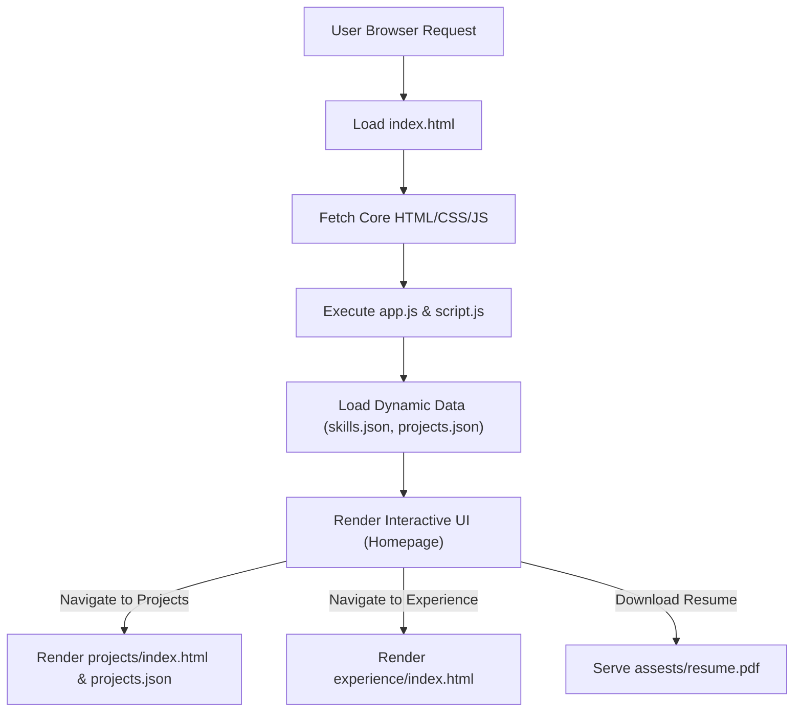

# 🚀 Modern Developer Portfolio

<p align="center"></p>

## Short Description
Unleash your professional story with this dynamic, visually captivating, and highly functional personal portfolio website. Crafted to impeccably showcase a developer's skills, projects, and professional journey, this repository provides a robust, customizable, and production-ready foundation for your online presence. Engage your audience with elegant design, interactive elements, and a seamless user experience.

## ✨ Key Features
*   **Stunning & Responsive Design:** A modern, clean aesthetic ensures your portfolio looks impeccable on any device.
*   **Interactive UI:** Powered by JavaScript and a captivating particle effects library (`particles.min.js`), the interface is engaging and memorable.
*   **Dynamic Content Management:** Easily update your skills and projects via dedicated JSON files, ensuring your portfolio is always current without code changes.
*   **Dedicated Sections:** Comprehensive `Skills`, `Projects`, and `Experience` pages to highlight every facet of your expertise.
*   **One-Click Resume Download:** Provide instant access to your professional resume (`assests/resume.pdf`) for prospective employers.
*   **Robust CI/CD Pipeline:** Integrated GitHub Actions (`.github/workflows/ci-cd.yml`) for automated testing and deployment, streamlining your development workflow.
*   **Custom 404 Page:** A branded and user-friendly error page (`404.html`) enhances the overall site experience.

## Who is this for?
This project is designed for **software developers, designers, and tech professionals** who want to:
*   Create a compelling and memorable online presence.
*   Present their work and experience in a structured, professional manner.
*   Impress recruiters, hiring managers, and potential clients.
*   Have a low-maintenance, high-impact platform to showcase their growth.

## Technology Stack & Architecture
This portfolio is built on a lean, efficient, and widely adopted web stack, emphasizing performance and maintainability:
*   **Frontend:** Pure HTML5, CSS3, and JavaScript for a blazing-fast, interactive user experience.
*   **Styling:** Custom CSS (`assests/css/style.css`, `experience/style.css`, `projects/style.css`) for a tailored, unique look.
*   **Interactivity:** Vanilla JavaScript (`assests/js/app.js`, `experience/script.js`, `projects/script.js`) for dynamic content loading and UI enhancements.
*   **Animations:** Leverages `particles.min.js` to add an elegant, modern visual flair.
*   **Development Tooling:** `.vscode` settings for consistent development environment.
*   **Automated Workflow:** GitHub Actions (`.github/workflows/ci-cd.yml`) for Continuous Integration and Continuous Deployment.

## 📊 Architecture & Database Schema
This project operates as a static site, delivering content directly to the user's browser. Content like skills and projects are loaded dynamically from local JSON files, eliminating the need for a backend database.



## ⚡ Quick Start Guide
Get your personalized portfolio up and running in minutes!

1.  **Clone the repository:**
    ```bash
    git clone https://github.com/yuvraj2211/portfolio_website.git
    cd portfolio_website
    ```
2.  **Open in your browser:**
    Simply open the `index.html` file in your web browser.
    ```bash
    open index.html # For macOS
    start index.html # For Windows
    xdg-open index.html # For Linux
    ```
3.  **Customize your content:**
    *   Update `skills.json` and `projects/projects.json` with your own information.
    *   Replace placeholder images in `assests/images/` with your own.
    *   Modify `assests/resume.pdf` to reflect your current resume.
    *   Tailor the HTML, CSS, and JavaScript files to reflect your personal brand and style.
4.  **Deploy:**
    Leverage the built-in CI/CD pipeline by pushing your changes to your GitHub repository.

## 📜 License
This project is licensed under the terms found in the `LICENSE` file in this repository.